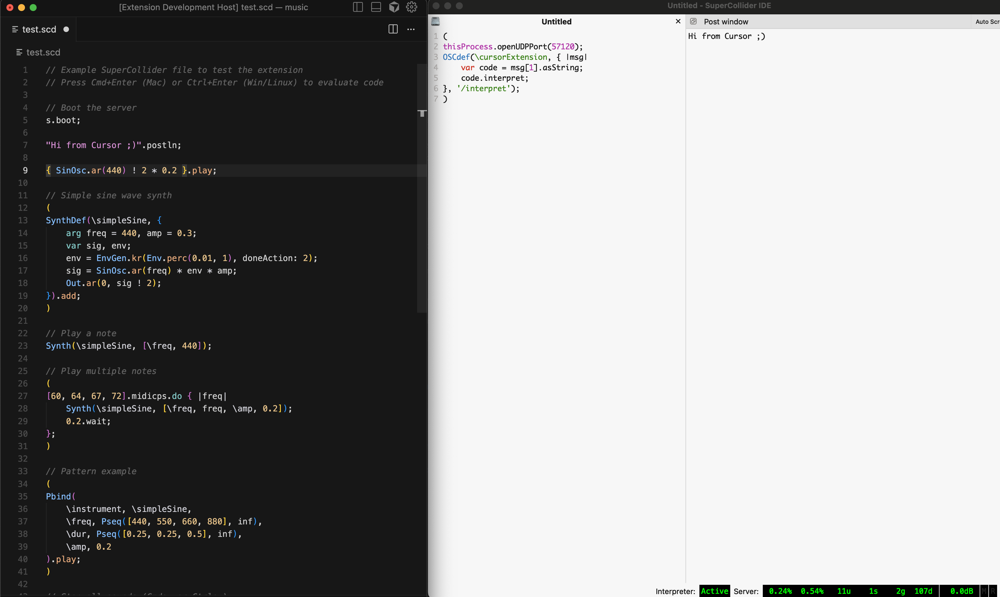

# SuperCollider VS Code Extension

A VS Code extension for SuperCollider that has syntax highlighting, code evaluation commands (CMD + Enter), sends messages to a running scide, opens docs (CMD + D), etc...

Note: A lot of these docs are AI generated since I built this in a weekend (sorry).



## Installation

### Marketplace
I got locked out of my Microsoft account, so I can't submit this to the market place 🤷

### From VSIX (Current - Local Development)
For VS Code, Cursor, et al:
1. Download the `.vsix` file
2. Open VS Code
3. Cmd + P → `Install from VSIX...`
4. Select the `.vsix` file

### From Source
```bash
git clone <repository-url>
cd supercollider-vscode
npm install
npm run compile
```

Then press F5 in VS Code to launch the extension in debug mode.

## Requirements

- **VS Code**: 1.75.0 or higher
- **Node.js**: 18.x or higher
- **SuperCollider**: 3.12 or higher (installed separately)
  - Download from: https://supercollider.github.io/

### Optional
- **SuperCollider LanguageServer Quark** - For LSP features
  ```supercollider
  Quarks.install("LanguageServer");
  ```

## Quick Start

1. **Install SuperCollider** if you haven't already
2. **Open scide** and evaluate the following code:
```supercollider
(
thisProcess.openUDPPort(57120);
OSCdef(\cursorExtension, { |msg|
    var code = msg[1].asString;
    code.interpret;
}, '/interpret');
)
```
3. **Open a SuperCollider file in VSCode/Cursor** (`.sc` or `.scd`)
4. **Start coding!** - Press `Cmd+Enter` (Mac) or `Ctrl+Enter` (Windows/Linux) to evaluate

## Configuration

Open VS Code settings (`Cmd+,` / `Ctrl+,`) and search for "SuperCollider":

| Setting | Default | Description |
|---------|---------|-------------|
| `supercollider.sclangPath` | `sclang` | Path to the sclang executable |
| `supercollider.oscHost` | `127.0.0.1` | OSC host address for sclang communication |
| `supercollider.oscPort` | `57120` | OSC port for sclang communication |
| `supercollider.useLanguageServer` | `true` | Enable Language Server Protocol features |
| `supercollider.languageServerPort` | `57121` | Port for the SuperCollider Language Server |

### Example Configuration

```json
{
  "supercollider.sclangPath": "/usr/local/bin/sclang",
  "supercollider.oscHost": "127.0.0.1",
  "supercollider.oscPort": 57120,
  "supercollider.useLanguageServer": true,
  "supercollider.languageServerPort": 57121
}
```

## Commands

All commands are accessible via Command Palette (`Cmd+Shift+P` / `Ctrl+Shift+P`):

| Command | Description | Keyboard Shortcut |
|---------|-------------|-------------------|
| `SuperCollider: Connect to sclang` | Connect to sclang via OSC | - |
| `SuperCollider: Start Language Server` | Start the Language Server | - |
| `SuperCollider: Boot Server` | Boot the SuperCollider audio server | - |
| `SuperCollider: Quit Server` | Quit the SuperCollider audio server | - |
| `SuperCollider: Evaluate Selection` | Evaluate selected code or current line | `Cmd+Enter` / `Ctrl+Enter` |
| `SuperCollider: Evaluate File` | Evaluate entire file | `Cmd+Shift+Enter` / `Ctrl+Shift+Enter` |
| `SuperCollider: Stop All Sounds` | Emergency stop all sounds | `Cmd+.` / `Ctrl+.` |
| `SuperCollider: Open Help for Symbol` | Open help documentation for symbol at cursor | `Cmd+D` / `Ctrl+D` |

## Usage

### Evaluating Code

1. **Parenthesized Block**: Place cursor anywhere inside a `( ... )` block and press `Cmd+Enter` (Mac) or `Ctrl+Enter` (Windows/Linux) - the entire block will be evaluated
2. **Single Line**: Place cursor on a line (outside any block) and press `Cmd+Enter` / `Ctrl+Enter`
3. **Selection**: Select specific code and press `Cmd+Enter` / `Ctrl+Enter`
4. **Entire File**: Press `Cmd+Shift+Enter` / `Ctrl+Shift+Enter`

**Example:**
```supercollider
// Place cursor anywhere in this block and press Cmd+Enter
(
    var synth = SynthDef(\test, {
        var sig = SinOsc.ar(440);
        Out.ar(0, sig ! 2);
    }).add;
    
    synth.play;
)
// The entire block above will be evaluated as one unit
```

### Getting Help

Place your cursor on any SuperCollider class, method, or symbol and press `Cmd+D` (Mac) or `Ctrl+D` (Windows/Linux) to open help documentation.

**Example:**
```supercollider
SinOsc.ar(440)  // Place cursor on "SinOsc" and press Cmd+D
```

The extension will:
1. **Try local help first** - Opens the installed SuperCollider help file (HTML or .scd)
2. **Fallback to online** - If local help isn't found, opens https://doc.sccode.org
3. **Smart detection** - Works for classes, methods, and topics

### Server Control

The extension automatically starts sclang when needed. You can also manually control:

1. **Boot Server**: Run `SuperCollider: Boot Server` from Command Palette (auto-starts sclang)
2. **Quit Server**: Run `SuperCollider: Quit Server` from Command Palette  
3. **Emergency Stop**: Press `Cmd+.` (Mac) or `Ctrl+.` (Windows/Linux) to stop all sounds

**No need to manually start SuperCollider first!** The extension handles it automatically.

### Status Bar

The status bar shows connection status:
- `SC ○` - Disconnected
- `SC ●` - Connected
- Hover for more details (LSP status)

## Development

### Setup

```bash
# Clone repository
git clone <repository-url>
cd sc-ext

# Install dependencies
npm install

# Compile TypeScript
npm run compile

# Run in development mode
# Press F5 in VS Code
```

### Testing

The extension includes a comprehensive test suite with 80+ automated tests.

```bash
# Run all tests
npm test

# Run only unit tests (fast)
npm run test:unit

# Run only integration tests
npm run test:integration

# Watch mode
npm run watch

# Using Python test script (cross-platform)
python scripts/test-quick.py all
python scripts/test-quick.py unit
python scripts/test-quick.py integration
```

See [TESTING.md](./TESTING.md) for detailed testing documentation.

### Project Structure

```
sc-ext/
├── src/
│   ├── extension.ts       # Extension entry point
│   ├── commands.ts        # Command implementations
│   ├── config.ts          # Configuration management
│   ├── oscClient.ts       # OSC client for sclang communication
│   ├── languageClient.ts  # Language Server client
│   └── test/              # Test suite
├── syntaxes/
│   └── supercollider.tmLanguage.json  # Syntax highlighting
├── scripts/
│   └── test-quick.py      # Test runner script
├── package.json           # Extension manifest
└── tsconfig.json         # TypeScript configuration
```

### Scripts

| Script | Description |
|--------|-------------|
| `npm run compile` | Compile TypeScript |
| `npm run watch` | Watch and compile on changes |
| `npm test` | Run all tests |
| `npm run test:unit` | Run unit tests only |
| `npm run test:integration` | Run integration tests only |
| `npm run lint` | Run ESLint |
| `npm run vscode:prepublish` | Prepare for publishing |

### Building VSIX

```bash
# Install vsce
npm install -g @vscode/vsce

# Build VSIX
vsce package
```

## Troubleshooting

### Extension Won't Activate
- Check VS Code version (must be 1.75.0+)
- Check for errors in Developer Tools (`Help` → `Toggle Developer Tools`)
- Reinstall extension

### Cannot Connect to sclang
- Ensure sclang is running
- Check OSC port configuration (default: 57120)
- Verify sclang OSC is enabled:
  ```supercollider
  NetAddr.langPort; // Should show your configured port
  ```

### Code Evaluation Doesn't Work
- Ensure you're connected to sclang (check status bar)
- Run `SuperCollider: Connect to sclang` command
- Check sclang is listening for OSC messages

### Language Server Not Working
- Install LanguageServer Quark in SuperCollider:
  ```supercollider
  Quarks.install("LanguageServer");
  ```
- Start the language server in sclang:
  ```supercollider
  LanguageServer.start(57121);
  ```
- Restart VS Code

### Tests Fail
See [TESTING.md](./TESTING.md) for troubleshooting test issues.

## Contributing

Contributions are welcome! Please see [CONTRIBUTING.md](./CONTRIBUTING.md) for guidelines.

### Development Workflow

1. Fork the repository
2. Create a feature branch
3. Write tests for new features
4. Implement features
5. Ensure all tests pass
6. Submit pull request

## Documentation

- [TESTING.md](./TESTING.md) - Comprehensive testing guide
- [TEST_GUIDE.md](./TEST_GUIDE.md) - Detailed test documentation
- [TEST_SUMMARY.md](./TEST_SUMMARY.md) - Test statistics and coverage
- [CONTRIBUTING.md](./CONTRIBUTING.md) - Contribution guidelines
- [CHANGELOG.md](./CHANGELOG.md) - Version history

## License

MIT License - see [LICENSE](./LICENSE) file for details.

## Credits

Created for the SuperCollider community.

## Links

- **SuperCollider**: https://supercollider.github.io/
- **VS Code API**: https://code.visualstudio.com/api
- **Issue Tracker**: [Your Issue Tracker URL]
- **Repository**: [Your Repository URL]

## Support

- **Documentation**: See docs in this repository
- **Issues**: Report bugs on GitHub
